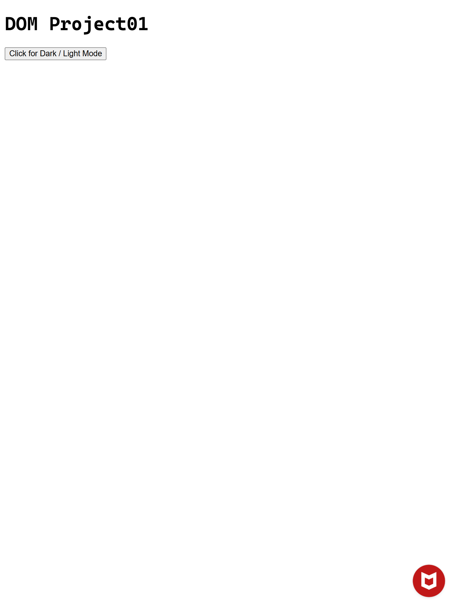

# JavaScript DOM

## Document Object Model

**Dark/Light Mode Toggle using JavaScript DOM**

- This code allows users to switch between Dark and Light themes on a website. It uses JavaScript to manipulate the DOM by toggling a CSS class name, id, tag name (e.g., `dark-mode`) on the `<body>` or another main container.

---

## Light Mode

- 

## Dark Mode

- 

---

## Demo Link

[Live Demo](https://domsampleproject01.netlify.app/)
